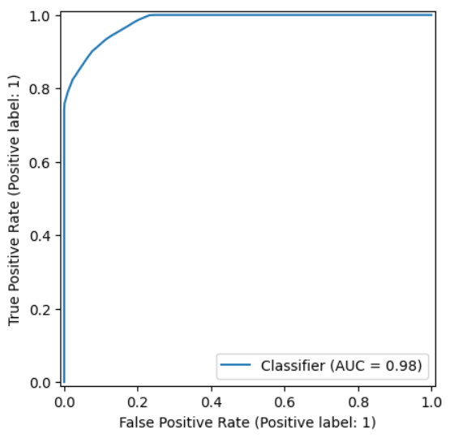
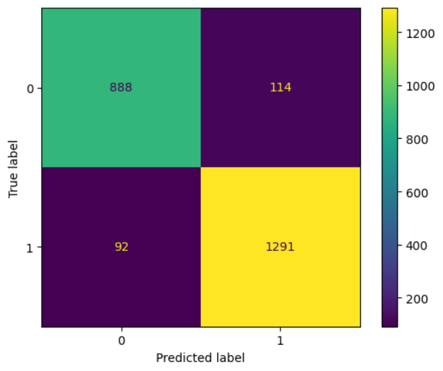
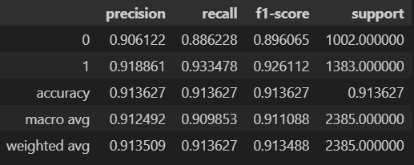

# Philippine Employability Classifier using Random Forests

## Description
A toy model I made after using Random Forest Classifier. 
Used to test the capability of thr Random Forest Classifier Model versus the Neural Networks I'm more familiar with.

### Contents

### Quick Figures:

ROC Curve under Test Data

Confustion Matrix under Test Data

Classification Report under Test Data

## Contents

The repository contains the following:
- **Data**:

  Contains the original .csv dataset (titled "Student-Employability-Datasets.xlsx") as well as its split versions, train and test, with train containing 80% of the data,
  while the test contains the remaining 20%.
  These Datasets are preprocessed by the Data_Preprocessing notebook located in the /Notebooks directory.
- **Model**:

  Contains the models saved through pickle and tensorflow's .keras extension; but for the notebook's Model_Evaluation, I used RFC_model.sav 
- **Notebooks**

  Contains the notebooks used to preprocess the data, construct the neural network, and evaluation.
  - Data_Preprocessing contains the preprocessing procedure on the dataset.
  - Model_Training_TF contains the neural network construction and its training, as well as some visualization on the model's performance during training (UNUSED)
  - Model_Training contains cross validation of the model and assessing its performance.
  - Model_Evaluation contains the Random Forest's performance on unseen data.
  - Philippine Employability contains the original notebook before it was split.
- **imgs**

  used for storing the images shown here.
- **tools**

  contains the following files:
  - power_transformer: Used Scikit-learn's PowerTransformer to fit and transform the training and testing data, V2 remains unused.

  
## Data Source
The dataset was originally sourced from Kaggle: 
[https://www.kaggle.com/datasets/fatemehmehrparvar/obesity-levels](https://www.kaggle.com/datasets/anashamoutni/students-employability-dataset)

